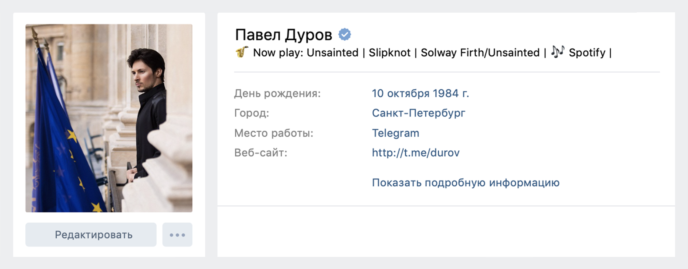
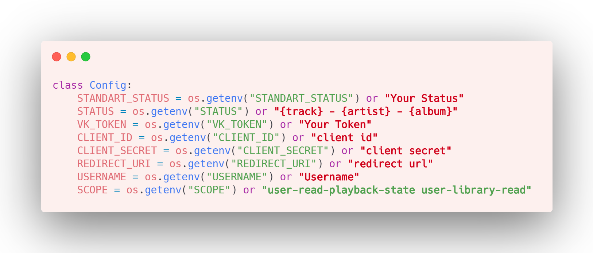

# Spotify to VK
### Display your current listen to a song from Spotify in the VK status.


###### Also, if you need to transfer your VK songs to Spotify, try my other app [SpotiTrans](https://github.com/feschenko/spotify-transfer).

# Installation:

###### Clone repository
```bash
$ git clone https://github.com/xcaq/spotify-to-vk.git
```

###### Go to "spotify-to-vk" folder
```bash
$ cd spotify-to-vk
```

###### Install libraries using pip

```bash
$ pip3 install -r requirements.txt
```

# Setting up:

###### Fill in the config

###### For easily setting you can use the command below, or use links in the FAQ by yourself. 

```bash
$ python3 first.py
```

# Usage:

```bash
$ python3 main.py
```

# FAQ:

1. #### Used libraries:
    - colorama
        - [pypi.org](https://pypi.org/project/Pillow/)
        - [github.com](https://github.com/plamere/spotipy)
    - vk_api
        - [pypi.org](https://pypi.org/project/vk-api/)
        - [github.com](https://github.com/python273/vk_api)
    - spotipy
        - [pypi.org](https://pypi.org/project/spotipy/)
        - [github.com](https://github.com/plamere/spotipy)
2. #### Config:
    - [Detailed instruction](installconfig.md)
    - [Creating an app for the Spotify](https://developer.spotify.com/dashboard/)
    - [Getting VKontakte token](https://oauth.vk.com/authorize?client_id=2685278&scope=1073737727&redirect_uri=https://oauth.vk.com/blank.html&display=page&response_type=token&revoke=1)


# 🤝 Contributing:
#### ❤️	&nbsp;Special thanks to <a href="https://github.com/MazZz3r">MazZz3r</a>.
#### <a href="https://github.com/xcaq/spotify-to-vk/graphs/contributors" align=center>Feel free to contribute.</a>


