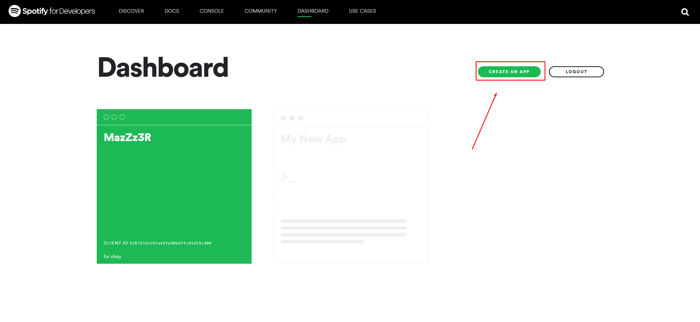
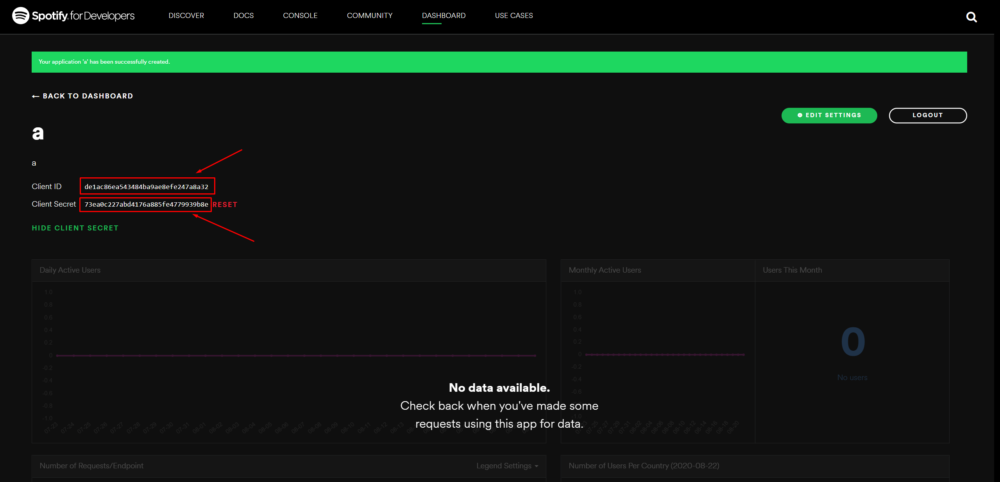
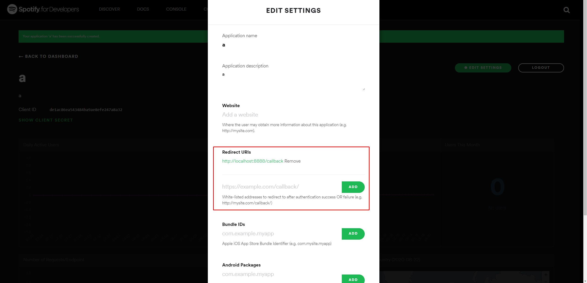
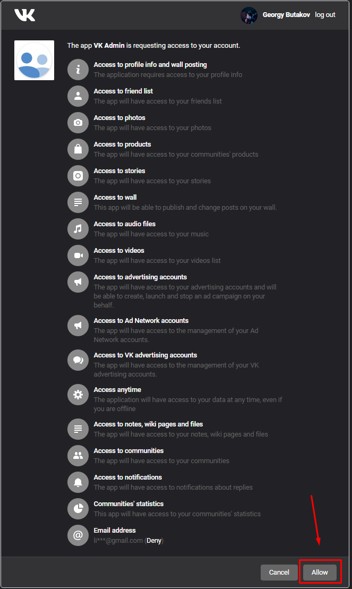

<h1 align="center"> Установка конфига для SpotifyToVk 🎵</h1>

## Spotify:
### 1. Создаем приложение в спотифай

### 2. Копируем `client_id` и `client_secret` в конфиг
###### Чтобы увидеть `client_secret`, надо нажать **SHOW CLIENT SECRET**

### 3. Нажимаем **EDIT SETTINGS** и указываем **Redirects URIs**
###### Если не знаете, что туда поставить, то ставьте `http://localhost:8888/callback`

### 4. Имя аккаунта, я думаю, вы знаете
---
## VK
### Переходим [ссылке](https://oauth.vk.com/authorize?client_id=2685278&scope=1073737727&redirect_uri=https://oauth.vk.com/blank.html&display=page&response_type=token&revoke=1)
#### Разрешаем и копируем ссылку, которая будет в браузере (никому не сообщайте ее)
###### Ваш токен будет заключен между строками `access_token=` и `&expires_in`, т.е. `....access_token=ТОКЕН&expires_in....`

